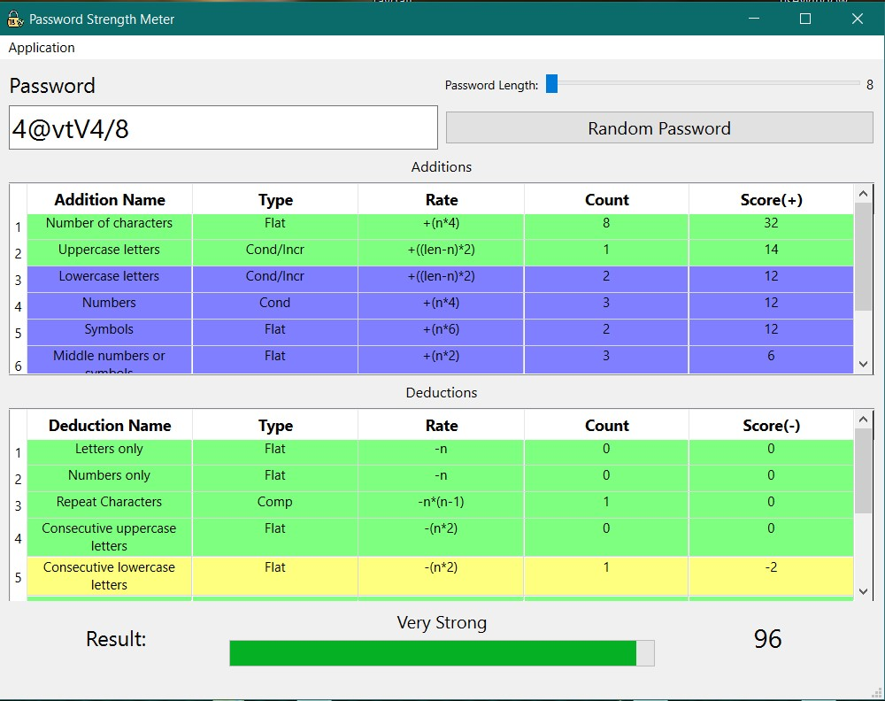
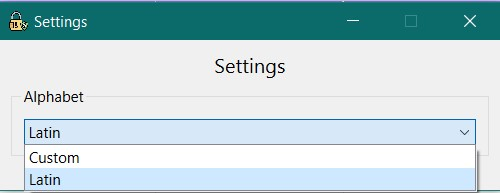
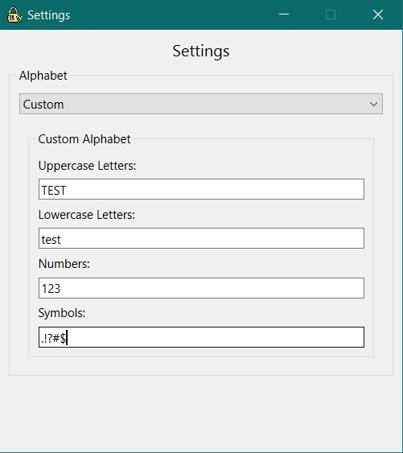

# Password Strength Meter

A simple application which calculate password strength.

##Rules of Calculating Password Strength
- **Additions**
    - Number of characters
    - Uppercase letters
    - Lowercase Letters
    - Numbers
    - Symbols
    - Middle numbers or symbols
    - Minimum requirements
- **Deductions**
    - Letters only
    - Numbers only
    - Repeat Characters
    - Consecutive uppercase letters
    - Consecutive lowercase letters
    - Consecutive numbers
    - Sequential letters (3+)
    - Sequential numbers (3+)
    - Sequential symbols (3+)

##Screenshots

- Application main window.

- Application settings window.

- Application custom language input setting.

## Used Libraries

[Qt C++ Ui Library](https://www.qt.io) - Version: 6.1.2
